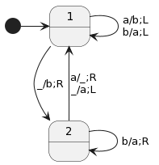

## 1. 1章 Rubyひとめぐり
- Rubyのレファレンスとして利用する．
- [requireとrequire_relativeの違い](https://zenn.dev/yukito0616/articles/e2f4b2ef94535d)

# 第1部プログラムと機械

## 2. 2章 プログラムの意味
- プログラムの意味を明確に記述するテクニックについて学ぶ．
- 意味を記述する様々な方法を調べることで，SIMPLEという
  おもちゃレベルのプログラミング言語を設計，実装する．

### 2.1. 「意味」の意味
- プログラミング言語を記述するには2つのものが必要である．
  1. **構文** プログラムの構造を決定する．
  2. **意味論** プログラムが何を意味するかを記述する．

- プログラミング言語を記述する方法
  1. 実装による仕様(specification by implementation)
  - 公式のレファレンス実装と振る舞いが同じであれば同じ言語と見なす．
  2. 公式文書として仕様書を書く
  - レファレンス実装に頼るよりも厳格
  - 読むのは大変だけどね
  3. 形式的意味論の数学的テクニックを利用する．
  - 形式意味論とは，プログラムの意味を明確にする方法を見つけて，
    プログラミング言語に関して興味深いことを発見したり証明すること
    を目標とする学問のこと．
    - 新しい言語の仕様化
    - コンパイラの最適化の工夫
    - プログラムの正当性の数学的証明

### 2.2. 構文
<!-- - 構文については「コンパイラ」で学んだ． -->
- 構文的には有効であっても，何ら意味を成さないプログラムもあり得る．
- 構文が意味とどう対応してるかを説明する唯一無二の方法はない．  
  これから，代表的な形式的アプローチについて調べていく．

### 2.3. 操作的意味論
- プログラムがある装置上でどのように実行されるのか，
  その規則を定義することでプログラミング言語の意味を
  記述する．
- 操作的意味論が実際にやろうとしていることは，
  インタプリタを記述することで言語の意味を説明
  すること．

#### 2.3.1. スモールステップ意味論
- プログラムの構成要素を小さなステップで繰り返し評価する
  方法を**簡約規則**として定義する．
- プログラムが完全に評価されるまで簡約規則に則って
  簡約を繰り返した結果が，そのプログラムの意味である．
<!--
- p.22  
  SIMPLEで書かれたプログラムを解釈して実行する
  抽象機械を実装するのではなく(結果的にそうなるが)，
  あくまで抽象機械が実行にあたって参照する簡約規則
  をRubyで記述することを目標としている． 記述を
  そのままインタプリタとして実行できるというのは
  副次的なボーナスである．
-->

#### 2.3.2. ビッグステップ意味論
- 小さな部分式を全て評価した結果をどう
  組み合わせて結果を得るかを記述する．
- より直接的にプログラム全体がどのように動くのか説明できる．
<!--
- p.46  
`x = y + 3`という代入文を考える．
  - スモールステップ意味論　　
  ```
  Assign.reduce()
    Add.reduce() // 左オペランドの簡約
      Variable.reduce()
    Add.reduce() // 実際の演算
  ```
  呼び出しそのものが計算過程になっており，
  どこまで計算が進んだのかは呼び出し側で
  管理される．

  - ビッグステップ意味論
  ```
  Assign.eval()
    Add.eval() // 実際の演算
      Variable.eval()
      Number.eval()
  ```
  計算の途中で部分的な評価を呼び出すため，
  どこまで計算が進んだのか記憶しておく必要がある．
-->

### 2.4. 表示的意味論
- すでに確立された別の言語の意味を利用して
  新しい言語を説明するというアプローチ．
- 表示的意味論による言語から言語への変換はコンパイル
  と似ている．`#to_ruby`実装は事実上，SIMPLEを
  Rubyへとコンパイルしている．
- 本書ではSIMPLEをRubyに変換することによって
  表示的意味論を与える．具体的には，環境(記号表を
  模したハッシュ)を引数にとり，値を表現するRuby
  オブジェクトを返すprocを定義する．
- 補足: Rubyは全ての値をオブジェクトとして扱う(see p.5)．

### 2.5. 実際の形式意味論
本章では，プログラムに意味を与えるという問題について
数学的な詳細には立ち入らず，Rubyを使うことでその意図を
垣間見ようとしてきた．実際の形式意味論では数学のツールを
用いる．

#### 2.5.1. 形式
正しい表示的意味論では，Rubyオブジェクトを使って「逃げ」
をすることなく，きちんと定義された数学的オブジェクトに
変換することでプログラムの核心に迫ろうとする．

通常は関数を使って式や文といったプログラミング言語の
構成要素を表示する．そして，数学的規約が関数の評価方法
などを決定づけるため，表示をそのまま操作的に考えることが
できる．

#### 2.5.2. 意味の理解
- 形式意味論の重要な応用
  - プログラミング言語の意味に曖昧さのない仕様を与える．
  - 具体的なプログラムの特性を証明する．
  - その言語におけるプログラムの等価性を証明する．  
  - 振る舞いを変えることなく効率を向上させるような
    プログラムを安全に変換する方法を見つける．
<!-- - p.55↑2「たとえば、」から始まる段落が理解できない． -->
- 2つの言語を共通の表現に変換する表示的意味論が存在すれば，
  別の言語で書かれた2つのプログラムを比較できる．

#### 2.5.3. その他のスタイル
本章で見てきた意味論の別の呼び名
- スモールステップ意味論
  - 構造的操作的意味論
  - 遷移意味論
- ビッグステップ意味論
  - 自然意味論
  - 関係意味論
- 表示的意味論
  - 不動点意味論
  - 数学的意味論

### 2.6. パーサの実装
- SIMPLEのASTを手書きで構築してきたが，
  ソースコードからパーサでASTに変換できるとありがたい．
- ここでは`Treetop`というドメイン固有言語を用いて
  パーサを自動生成する．
- Treetopでは構文と，それによって構築される構文木の
  各ノードに対するメソッド(操作)を同時に定義できる．
- `Treetop`によって生成されたパーサで，SIMPLEのソースコードを
  パースすることで`SyntaxNode`オブジェクトによる構文木に変換できる．
  この構文木の根に対してメソッドを呼び出すことで，本章で定義した
  SIMPLEの構文オブジェクトで構成されたASTを構築できる．

## 3. 3章 最も単純なコンピュータ
- ハードコードされた基本的なタスクを実行できる
  非常に単純な機械を設計する．
- 計算する機械というアイデアにある本質を明らかにし，
  それがどんな用途に使えるのか紹介しながら，
  単純なコンピュータにできることの制限について調べる．

### 3.1. 決定性有限オートマトン
- 実際のコンピュータとの比較

|              | 実際のCP                      | 有限オートマトン   | 
| -------------| ----------------------------| ----------------| 
| 永続的ストレージ | HDD or SSD                  | なし             | 
| 一時的ストレージ | RAM                         | 現状態           | 
| 入力          | キーボード，マウス，ネットワーク    | 文字ストリーム     | 
| 出力          | 表示デバイス，スピーカ，ネットワーク | 現状態 == 受理状態 | 
| プロセッサ     | 任意のプログラムを実行できるコア    | 状態遷移表/図      | 

- 文字のシーケンスを読んで受理か不受理を示すオートマトンは
  計算を実行していると言える．なぜならば，「この文字列の長さは
  奇数か」という質問に対して，意味のある答えを返せるから．
- 特定の機械が受理する文字列の集合は**言語**と呼ばれ，
  この機械はその言語を**認識する**と言ったりする．
- 有限オートマトンが認識できる言語は**正規言語**と呼ばれる．

#### 3.1.1. 状態，規則，入力

#### 3.1.2. 出力

#### 3.1.3. 決定性
- 矛盾がないこと  
  競合する規則があることによって，次の移動が曖昧になることがない．
- 省略がないこと  
  規則が欠けていることによって，次の移動が分からなくなるような状態がない．

#### 3.1.4. シミュレーション

### 3.2. 非決定性有限オートマトン
有限オートマトンに手を加えることで，
どんな可能性が切り開かれるのか見ていく．
- 決定性の仮定や制約を緩和する．
  - 関心のない文字に関する制約をなくしてしまい，
    想定外のことが起こると不受理とする．
  - 矛盾する規則を持つことを許し，複数の実行パスを可能にする．
- 何も読まなくても状態を変更できる($\varepsilon$遷移)．

#### 3.2.1. 非決定性

#### 3.2.2. 自由移動

### 3.3. 正規表現
- 有限オートマトンの重要かつ実用的な応用である
  正規表現マッチングについて見ていく．
- 任意の正規表現はそれと等価なNFAに変換できる．
  これは正規表現のための表示的意味論を提供している
  と言える．
- 我々は既にNFAのための操作的意味論(文字を読んで
  規則に従うことで状態を変更する)を手にしているため，
  その表示を実行することで同じ判定結果を得ることができる．

#### 3.3.1. 構文
- これ以上分解できない正規表現
  - 空文字列$\varepsilon$
  - 1つのリテラル文字
- パターンの組み合わせ方
  - 連結
  - 選択`|`
  - 繰り返し`*`

#### 3.3.2. 意味論
- 任意のパターンをNFAに変換する方法を示すことで，
  構文に意味論を与える．

#### 3.3.3. パース
- 意味論とパーサ(操作的意味論の実装)を組み合わせることで，
  正規表現を読んで特定の文字列にマッチするかどうかを判定する
  現実的な手段を得ることができる．

### 3.4. 等価性
- 任意のNFAは同じ仕事をするDFAへと変換できる．
  そのDFAは，NFAの取り得る状態の集合を表現する状態を持ち，
  その状態の集合間をどのように移動するかという規則を持つ．
- 非決定性と自由移動は，DFAでできることを便利にしただけであり，
  決定性という制約を超えて新たな能力をもたらすものではない．
  プログラミング言語にあるシンタックスシュガーのようなものである．
- とはいえ，DFAはNFAよりもシミュレートしやすい．
  プログラムのアドレスを状態，条件分岐命令を遷移として使えば，
  高速でシミュレートできる非常に単純な機械が得られる．

### 3.5. DFAの最小化
DFAの状態数を最小化する方法として**Brzozowskiのアルゴリズム**
が知られている．興味深いことに，最小化したDFAは**正準**
(canonical)でもある．つまり，全く同じ文字列を受理する
2つのDFAは同じ設計に最小化される．これは2つの正規表現が
等価であることを判定するエレガントな方法になる．

## 4. 4章 能力を高める
<!-- - さらに高機能な機械にしていく． -->
- 有限オートマトンの応用は，文字シーケンスを受理するか否か
  という特殊な用途に限られており，この限定された範囲ですら
  認識できない言語がある．
- ダイク言語やHTMLなど，任意の深さのペアについて定義されている
  言語を認識することはできない．
- 根本的な問題はある有限の状態集合という制限されたストレージしか
  持っていないことにある．

### 4.1. 決定性プッシュダウン・オートマトン
- 計算中にデータを保持できる専用の書き込みスペース(スタック)
  を使って有限状態機械を拡張する．
- もちろん，現実世界におけるスタックはコンピュータのRAMサイズや
  ハードディスクの空き容量によって制限を受けるが，思考実験なので
  こうした制約は無視して考える．
- 組み込みのスタックを持つ有限状態機械は
  **プッシュダウンオートマトン**
  (PDA: Pushdown Automaton)と呼ばれる．

#### 4.1.1. ストレージ

#### 4.1.2. 規則
- PDA規則を構成する項目
  - 現状態
  - 入力文字
  - 次状態
  - スタックからポップする文字
  - スタックにプッシュする文字列
- PDAは状態を遷移する度に必ずスタックのトップにある
  文字をpopし，その後いくつかの文字をpushするものとする．
- スタックが本当に空になると適用できる規則がなくなるため，
  スタックのボトムを示す特殊な文字($)を用意する．
- 本書における表記`入力文字;popする文字/pushする文字列`

#### 4.1.3. 決定性
- PDAにおける決定性が何を意味するか明確に定義しておく．
- 「矛盾がない」という制約はDPDAにも同様に適用する．
- 状態と入力文字とスタックのトップの文字の可能な組み合わせは
  あまりに膨大なので，「省略がない」という制約には目をつぶる．
- 適用できる規則がない状況に至った場合は**行き詰まり状態**
  になるものとする(NFAと同じ)．

#### 4.1.4. シミュレーション
- PDAの場合，計算の各ステップで記憶しておくべき情報が
  2つある．現状態とスタックの内容をまとめて**構成**と
  呼ぶことにする．
  <!-- (see コンパイラp.70) -->

### 4.2. 非決定性プッシュダウンオートマトン
- ダイク言語の認識においては，スタックはカウンタとして
  使われているだけで，LIFOの性質を活用できていない．
- スタックが持つ潜在能力を発揮するためには，格納する順番に
  意味があるような問題が必要になる．
- 古典的な例が回文の認識であるが，文字列の真ん中を示す
  マーカー文字がないと，どこで折り返せばよいのか分からない．
- 決定性制約を緩和して機械が入力を読まずして状態を変更
  できるようにする．

#### 4.2.1. シミュレーション

#### 4.2.2. 非等価性
- 任意のNFAを同じ文字列を受理するDFAへと変換することは
  できたが，任意のNPDAをDPDAに変換するアルゴリズムは
  存在しないことが分かっている．複数のNPDA構成を1つの
  DPDA構成として表現できないためである．
- NPDAシミュレーションは，取り得るスタックのトップにある
  全ての文字を把握する必要があり，複数のスタックを同時に
  push,popする必要がある．
- 状態の異なるスタックを1つのスタックとして組み合わせる
  術はないため，DPDAはトップにある文字を全て調べて，
  全てのスタックに個別にアクセスすることになるが，DPDAには
  それを扱えるだけの能力がない．
- したがって，NPDAはDPDAよりも能力が高い．

### 4.3. プッシュダウンオートマトンによるパース
- 有限オートマトンが正規表現マッチングに使えることは既に確認した．
- PDAにもプログラミング言語のパースという重要かつ実用的な応用がある．
- 前章では`Treetop`を使ってパーサを構築したが，伝統的な
  アプローチではパース処理を異なる2つのステージに分ける．

1. **字句解析**
    - 生の文字列を読んでトークンのシーケンスに変換する．
    - 文字列をいくつかの規則にマッチさせ，
      予約語・識別子・演算子などに判別する．
2. **構文解析**
    - トークンのシーケンスを読んで，パースされる言語の構文に
      したがって有効なプログラムを表現しているか判断する．
    - 有効なプログラムであれば，構文に関する追加の情報(構文木)
      を生成する．

#### 4.3.1. 字句解析
- 本書の実装ではトークンとして1つの文字を使っている．
  `w`はwhileキーワードを意味し，`+`は加算演算子を
  表す．
- 実際のパーサでは，トークンを適切なデータ構造(列挙体や構造体)
  を使って表現し，文字以上の情報をやり取りする必要がある．

#### 4.3.2. 構文解析
- SIMPLEの構文を**文脈自由文法**で与える．
  文脈自由であるとは，その規則が構文が出現する
  文脈について何も指定していないことを意味する．

```
statemrnt ::= while | assign
while ::= 'w' '(' expr ')' '{' statement '}'
assign ::= 'v' '=' expr
expr ::= less-than
less-than ::= mult '<' less-than | mult
mult ::= term '*' mult | term
term ::= 'n' | 'v'
```

- 文脈自由文法をPDA規則に変換する手順
  1. 文法の各シンボルを表現する( 1 )文字を選ぶ．
  2. 認識しようとする構造を表すシンボルをスタックにプッシュする．
     文を認識したいとすれば，スタックにSをプッシュしたところから
     開始する．
  3. それぞれの文法規則を，入力を読まずに左辺のシンボルをpopし，
     右辺のシンボルとトークンのシーケンスをpushするPDA規則
     (シンボル規則)に変換する．
  4. 全てのトークンに対して，入力からその文字を読み，スタックから
     その文字をpopするPDA規則(トークン規則)に変換する．
  5. スタックが空になれば，機械を受理状態にするPDA規則を作る．

- スタックのトップに`S` `L` `M` `T`があるときに
  適用可能な規則が2つあるため，SIMPLAの構文によって
  生成されるPDA規則は非決定的である．

#### 4.3.3. 実用性
- 実際の応用では，**先読み**をすることで適用する規則を
  (ほとんどの場合)一意に選ぶことができ，非決定性を除去できる．
- パースの本質は，有効なプログラムを認識することではなく，
  プログラムを構造化された表現に変換するところにある．
- 受理状態に至るまでに従った規則を辿ることで構文木を構築できる．

### 4.4. どれだけの能力があるか
- PDAはスタックが提供する無限ストレージのおかげで
  過去の内容を保存しておいて後で参照できるようになった．
- PDAの計算能力は，依然としてスタックの振る舞い(LIFO)
  によって制限されている．
  - popした文字は永久に失われてしまう．
  - pushした逆順でしか消費できない．
- 汎用コンピュータのモデルとして扱うには程遠い
  - 受理か不受理しか出力できない．
  - それぞれのPDAのプログラムは固定されており，
    入力から読んだプログラムを実行とかはできない．
- コンピュータができることを本当に調査するためには
  もっと優れた計算モデルが必要である．
  $\rightarrow$ 次章

## 5. 5章 究極の機械
- 1930年代において「コンピュータ」という言葉は「計算する人」
  (通常は女性)を意味していた．一連の骨の折れる演算を手作業で
  繰り返すことにより，計算を実行していた．
- アラン・チューリングは人間による「コンピュータ」の操作を理解し，
  その特性を明らかにする方法を追い求めた．その結果，同じタスクを
  完全に機械で実行可能にした．
- 本章ではチューリングの革命的なアイデア，ソフトウェアで制御できる
  最も単純な汎用コンピュータを設計する方法について見ていく．

### 5.1. 決定性チューチングマシン
- PDAが利用するスタックには，格納した後のデータの利用方法に不便な
  制限があった．もっと柔軟なストレージに置き換えることによって，
  機械の能力を高めることができる．

#### 5.1.1. ストレージ
- チューリングは，機械に無限の長さのマス目で区切られたテープを
  持たせ，テープの任意の場所に文字を読み書きできることにした．
- この無限の長さのテープにランダムアクセスできる有限状態機械の
  ことを**チューリングマシン**と呼ぶ．
- チューリングマシンは**テープヘッド**を使ってテープにアクセス
  する．テープヘッドはテープ上の特定の位置を指し，その位置に
  ある文字のみを読み書きできる．
- 機械は計算を1ステップ実行する度に，テープヘッドを左右どちらかに
  1マス動かせる．

#### 5.1.2. 規則
- 計算の各ステップでTMが実行する操作
  - テープヘッドの位置にある文字を読む．
  - その位置に新しい文字を書く．
  - ヘッドを左右どちらかに動かす．
- TM規則を構成する項目
  - 現状態
  - テープヘッドの位置にあるはずの文字
  - 次状態
  - テープヘッド位置に書く文字
  - ヘッドを動かす方向


| 特殊ケース           | 解決策                    | 
| ------------------ | ----------------------- | 
| 状態を変更しない       | 次状態を現状態とする         | 
| テープの内容を変更しない | 読んだ文字と同じ文字を書く     | 
| ヘッドを動かさない     | ヘッドを元の位置に戻す規則を導入 | 

#### 5.1.3. 決定性
- DPDAと同様の方針で決定性を定義する
- 現状態とテープヘッドの文字の組み合わせに対して
  「矛盾のない」規則を1つだけ持てる．
- 可能な全ての状況に対して規則を持つ代わりに，適用できる
  規則がないときは行き詰まり状態になるものとする．

#### 5.1.4. シミュレーション
- 4章ではPDAの状態のスタックの組み合わせを指して
  **構成**と呼んだが，TMにも同様の用語を用いる．
  TMの構成は状態とテープの組み合わせである．
- テープと規則集を表現するデータ構造ができてしまえば，
  TMをシミュレートするのはそれほど難しくない．
- TMは実装が単純になるように設計されており，
  構築も論証も簡単である．

### 5.2. 非決定性チューリングマシン
- TMにおける決定性とは，状態と文字の組み合わせ(構成)
  に対して複数の規則を許すことを意味する．
- 非決定性を追加してもTMの能力を高めることはできない．
  - 有限オートマトンの場合は1つの状態で
    複数の状態の組み合わせを表現できた．
  - TMの場合は1本のテープで
    複数のテープの内容を格納できる(p.148)．
  - PDAの場合には1つのスタックで
    複数のスタックを同時に表現できない．

### 5.3. 最大の能力
- TMは制限のある計算機械から完全な能力を備えた
  計算機械への劇的な転換点を示している．
- TMに新しい機能を追加して効率良くすることはできても，
  新しい能力を与えることは基本的に不可能である．
- 以降は，その他の伝統的なTMの拡張について，なぜそれが
  計算能力を高めることにならないのか見ていく．

#### 5.3.1. 内部ストレージ
- TMには内部ストレージがないため，以前呼んだ文字を
  覚えておく手段がない．これに依存したアクションは
  実行できない．
- TMが利用できる状態の数には上限がないため，覚えておきたい
  情報の数だけ状態を用意し，それぞれに同じ規則を複製すれば
  解決できる．条件分岐の数だけ実行パスを用意すればよい
  ということ．

#### 5.3.2. サブルーチン
- ある仕事をするための規則を機械の一部に格納しておく
  ことができれば規則集の設計は簡単になるが，機械の
  能力を高めるものではない．
- 正規表現の一部を実装したNFAを複数つなげることで，
  より大きな正規表現を構築できたように，TMを複数
  つなげることで，より大きなTMを構築できる．
- 小さな機械が呼び出される場所ごとに，
  その状態と規則のコピーを組み込めばよい．

#### 5.3.3. 複数のテープ
- PDAにスタックをもう1つ追加すると無限の長さの
  テープをシミュレートできるようになるため，
  TMと同じ能力を獲得する．
- 複数のテープを1本のテープに畳み込めるため，
  TMにテープを追加しても新しい能力は得られない．

#### 5.3.4. 多次元のテープ
- 2次元の格子は1次元のテープを2本使うことでシミュレート
  できる．1本目のテープはデータを格納するのに使い，2本目の
  テープは[スクラッチ領域](https://www.netinbag.com/ja/internet/what-is-scratch-space.html)として使う．
- シミュレートする格子の各行を，行の末尾を特別な文字で
  マークしながら1本目のテープに格納する．
- 格子を上下に動くには，テープヘッドを現在の行の先頭/末尾まで
  動かし，そこまでの移動距離を2本目のテープに記録する．それから，
  前もしくは次の行で同じオフセット分だけ動かす．
- 複数のテープは1本のテープでシミュレートできるため，
  最終的な能力に違いはない．

### 5.4. 汎用機械
- これまで見てきた機械には規則がハードコードされており，
  様々なタスクに適用できないという重大な欠点がある．
- TMはテープから機械の記述(規則，初期構成，受理状態)を読み込んで，
  その機械がやるべきことを調べてシミュレーションを実行できる．
  TM自体のシミュレーションも例外ではない．
- 任意のTMの記述を読み込んで，その動作を完全にシミュレート
  できる機械を**万能チューリングマシン**
  (UTM: Universal Turing Machine)と呼ぶ．

#### 5.4.1. エンコード
- TM全体をテープ上の文字列としてどのように表現するのか．
- エンコードする上での課題

  - TMが扱えるアルファベットは有限である．  
  テープ上で$n$種類の文字を扱えるようなUTMを設計した場合，
  $n + 1$種類の文字を使った規則を持った機械はどうやっても
  シミュレートできない．

  - シミュレートする機械とUTMの間に文字の衝突が発生する恐れがある．  
  テープ上にTMの規則と構成を格納するためには，規則同士の
  境界となる印が必要になる．シミュレートする規則のどこかに
  その文字が含まれていると問題となる．

- ある決まった範囲の文字を使って，シミュレートする機械の
  テープ内容をエンコードするスキームを考案することで解決できる．
- 例えば，2進表現を使って個々の文字をエンコードし，$\{0, 1\}$
  以外の文字を2進の値を区切るマーカとして使うことができる．
- 規則の各パーツ
  - 状態にはそれぞれ固有の番号を割り当て，その番号をエンコードする．
  - 文字は先の方法でエンコードする．
  - ヘッドを動かす方向は左右を表現する専用の文字(L,Rなど)を使う．
- 必要なところにセパレータ文字を入れながら，各パーツ及び規則
  をつなぎ合わせることで規則集全体を表現できる．

#### 5.4.2. シミュレーション
- UTMはシミュレーションの1ステップを実行するため，
  規則と現状態とテープの間でヘッドをあちこち動かして，
  適用すべき規則を探す．
- 規則が見つかると，それに従って機械の状態とテープを更新する．
- シミュレートしている機械が受理状態になるまで，もしくは
  適用できる規則がなくなって動けなくなるまで上記のプロセスを
  繰り返す．


# 第2部 計算と計算可能性
- 第1部ではなじみのある計算を扱い，計算とは多かれ少なかれ
  システムを使って情報を操作することで質問に答えるプロセスだ
  ということを学んだ．
- 第2部ではなじみのないところにある計算を探すところから始めて，
  計算する機械の根本的限界について調べていく．

## 6. 6章 無からのプログラミング
- 計算のモデルを構築することで計算を理解しようとしてきた．
- TMの計算能力の検証を通して，本格的な計算には必ずしも
  複雑さを備えた機械は必要なく，値を格納し，取得し，
  それを使って単純な判断ができれば十分だということが分かった．
- この章では，最小限のプログラミング言語**型なしラムダ計算**
  について調べ，計算にとって不可欠な機能を吟味する．

### 6.1. ラムダ計算を真似る
- 最小限の言語でプログラミングするとはどんなものか
  理解するため，Rubyのprocのみを用いてFizzBuzz
  問題を解く．
- procを定数に代入することで後から再利用できるように
  名前を付けることを許す．これはコードの冗長性を
  取り除いてるだけであって，Rubyの代入機能には依存
  していない．

#### 6.1.1. procの利用
まずはprocの特性について少し調べる．

##### 配管
- procは実際に仕事をするRubyの部品に値を流す
  配管のようなものである．

##### 引数
- procは複数の引数をとることができるが，ネストした引数
  1つのprocに書き直せる．これは**カリー化**と呼ばれる．
- 本章ではRubyの機能をできる限り絞ろうとしているので，
  引数1つのprocの生成と呼び出しに制限する．

##### 等価性
- 内部のコードが異なっていても同じ引数で呼び出して同じ
  結果を生成するのであれば，2つのprocは交換可能だと言える．
  - `q = ->x { p[x] }`は`p`というprocと等価である．
- 外から見える振る舞いに基づいて2つを等価に扱うという考えは
  **外延的等価性**と呼ばれる．

##### 構文
procの生成と呼び出しの構文には以下の構文を用いる．
- procの生成 `-> arguments { body }`
- procの呼び出し `proc[arguments]`

#### 6.1.2. 問題
- FizzBuzzの素直な実装

```ruby
(1..100).map do |n|
  if (n % 15).zero?
    'FizzBuzz'
  elsif (n % 3).zero?
    'Fizz'
  elsif (n % 5).zero?
    'Buzz'
  else
    n.to_s
  end
end
```
- このプログラムをprocだけを使って実装する．

#### 6.1.3. 数 (非負の整数)
- 数はあるアクションの繰り返しによって特徴づけることができる．
- プログラムで実行できる唯一のアクションはprocの生成と呼び出し
  なので，procを呼び出す回数によって数を定義できる．

#### 6.1.4. ブール値
- ブール値は条件文で使うためだけに存在し，
  2つの選択肢から選ぶ役割を果たしている．
  これに基づくと，2つの値から1つを選ぶprocとして表現できる．
- `if-elsif-else`文もブール値と同じ方法で実装できる．
  ブール値自体が適切な引数を選んでくれるため，`IF`は単なる
  シンタックスシュガーに過ぎない．
<!--
- これを考慮すると`IF`が単純化できることには納得できるが，
  具体的な説明は理解できなかった．
-->

#### 6.1.5. 述語
- 値としてブール値のみをとる関数を**述語**という．
  先のFizzBuzzプログラムでは`Fixnum#zero?`が述語にあたる．
- `ZERO`はprocを呼び出さない唯一の数であることを利用すると，
  `ZERO`の返り値のみを`TRUE`に設定し，`ZERO`以外の数は
  procの呼び出しで`FALSE`を返すようにすれば所望の振る舞いを
  実現できる．

#### 6.1.6. ペア
- 複雑な実装をするための前準備として，複数の値をまとめて
  格納するためのデータ構造を導入しておく．

#### 6.1.7. 数値演算
- インクリメントは引数よりも1回多くprocを呼び出せばよい．
- デクリメントは，左側が右側よりも1だけ小さいペアを宣言し，
  引数と同じ数だけスライドさせた後の左側の数を返すproc
  として実装する．
- procベースの数には負数を表現する能力がないので
  小さな数から大きい数を引いても`ZERO`が返ってくる．
- インクリメントとデクリメントを利用して加算・減算・乗算・
  指数演算を実装できる．

#### 6.1.8. `%`演算子
- Rubyネイティブな数による仕様  

```ruby
def mod(m, n)
  if n <= m
    mod(m - n, n)
  else
    m
  end
end
```

  別の演算子`<=`が使われているため，まずはこれを実装する．
- $m \leq n$の判定には$m - n$を計算すればよいが，
  procベースの数は非負の整数であるため，$m < n$
  の場合であっても0が返ってくる．したがって，$m - n$が
  0か否かによって判定すればよい．

- 先の仕様を素直にprocに落とし込むと

```ruby
MOD = -> m { -> n {
    IF[IS_LESS_THAN_OR_EQUAL[n][m]][
      MOD[SUBTRACT[m][n]][n]
    ][
      m
    ]
}}
```

- この実装ではMODを呼び出すと無限ループに陥ってしまう．
  なぜならば，`IF`がtrue節とfalse節どちらを返すか
  判断する前に両方を評価してしまうから．
- Rubyの`if-else`文は[非正格](https://ja.wikipedia.org/wiki/評価戦略)
  であり遅延評価が組み込まれているが，この実装ではサポートしていない．
- 修正するには，`IF`の第2引数が必要と分かるまで，
  その評価を遅延させなければならない．Rubyの場合，
  式をprocでくるむことで評価を遅延させることができる．
- 「等価性」で見たように，proc pと同じ引数をとり，すぐにその
  引数でpを呼び出すようなprocでpをくるんでも同じ値を返す．
  - `MOD[m - n][n]`
  - `-> x { MOD[m - n][n][x] }`
- このことを利用すると`IF`の定義を変更することなく
  再帰呼び出しを遅延させることができる．

<!-- 
```ruby
# MOD[THREE][TWO]のトレース

-> THREE { -> TWO {
  IF[IS_LESS_OR_EQUAL[TWO][THREE]][
    # true節が選択される
    -> p { MOD[ONE][TWO][p] }
  ][
    m
  ]
}

-> p {
  -> ONE { -> TWO {
      IF[IS_LESS_OR_EQUAL[ONE][TWO]][
        # true節は評価されない
        -> p { MOD[ZERO][TWO][p] }
      ][
        # false節が選択される
        ONE
      ]
    }
  }
}

-> p { ONE[p] }
-> p { -> x { p[x] } }
```
-->

- これで実行自体はうまくいくが，`MOD`の実装の中で`MOD`を
  参照しているため，`MOD`に具体的な定義を与えたことには
  ならない．
- **Yコンビネータ**という再帰関数を実現するための
  ヘルパーコードを使うことで解決できる．
- Yコンビネータは評価を遅延させないため，Rubyのような正格な
  言語では無限ループに陥る．問題となっている部分をprocでくるんで
  評価を遅延させた**Zコンビネータ**を用いる．
- 参考サイト
  - [コンビネータ](https://scrapbox.io/mrsekut-p/コンビネータ)
  - [おとうさんにも分かるYコンビネータ!](https://r-west.hatenablog.com/entry/20090417/1239972722)
  - [Y/Zコンビネータについて理解するまで](https://k5trismegistus.me/entry/Y/Zコンビネーターについて理解するまで)

#### 6.1.9. リスト
- 残りの機能はあまり詳細には立ち入らずざっと流して雰囲気を掴む．
- 範囲と`map`を実装するにはリストを実装する必要がある．
- 範囲をprocとして表現する代わりに，ある範囲にある全要素の
  リストを構築するprocを実装する．
<!-- - `map`を実装するには`FOLD`というヘルパーを使う． -->

#### 6.1.10. 文字列
- 文字を数としてどう表現するか(エンコーディング)が決まれば，
  文字列は単なる数のリストとして表現できる．
- FizzBuzzにおけるエンコーディング
  - `0` ~ `9`の文字: 0 ~ 9の数
  - `B` `F` `i` `u` `z`: 10 ~ 14の数
- 数から文字列へ変換するには，各桁を数字に変換した文字を
  つなぎ合わせる．

### 6.2. 高度なプログラミングテクニック
- プログラムを完全にprocだけで組み立てるのには大変な
  労力を必要とするが，実際に可能であることを見てきた．
- この最小限の環境でコードを書くためのテクニック
  について簡単に見ていく．

#### 6.2.1. 無限ストリーム
- データを純粋なコードとして表現することには
  興味深い利点がいくつかある．
- procベースのリストはその場で内容を計算して生成でき，
  大きさにも制限はない．(理論的には)新しい値を無限に
  生成し続けることができる．
- フィボナッチ数列やアルファベット順の文字列など，
  一定の規則で計算できるものであればどんな無限リストでも
  生成できる．

#### 6.2.2. 再帰の回避
- Zコンビネータの利用例として`MOD`や`RANGE`といった
  再帰関数を実装したが，技術的にはZコンビネータを使わずに
  実装できる．

##### `MOD`
- 再帰で繰り返しを動的に制御する代わりに
  「$n \leq m$であれば$m$から$n$を引く」というアクションを
  固定回繰り返せば剰余を求めることができる．
- 繰り返し回数は$n = 1$のときが最悪で$m$回．
- 実装は単純になるが，常に最悪の場合の数だけ
  呼び出しを繰り返すため効率は悪い．

##### `RANGE`
- `DECREMENT`と同じテクニックが使える．ペアによって
  結果としてのリストと次のイテレーションに必要な情報の
  両方を格納する．
- 各呼び出しで右の要素を左のリストの先頭に挿入し，
  右の要素をデクリメントする．これを$m - n + 1$回繰り返す．

`MOD`と`RANGE`が所定の回数だけ反復を実行することで
実装できるのは**原始再帰関数**だから．詳しくは後ほど．

### 6.3. ラムダ計算の実装
- 最小限の言語が実際どのように動くのか雰囲気を掴むために
  ラムダ計算のスタイルでRubyプログラムを書いてみた．
- ラムダ計算インタプリタを構築し，それを使って実際の
  ラムダ式の評価に挑戦する．

#### 6.3.1. 構文
- 型なしラムダ計算には変数，関数定義，呼び出しという
  3種類の式しかなかった．
- ラムダ計算においても同様の構文を使い続けることにする．
  - 変数: `x`
  - 関数: `-> x { x }`
  - 呼び出し: `x[y]`
- 本来のラムダ計算では`->`のところに$\lambda$を使う．  
  例えば，`ONE`は$\lambda p.~\lambda x.~p~x$
  と書く．

#### 6.3.2. 意味論
- それぞれの構文クラスに`#reduce`メソッドを実装することで
  スモールステップ意味論を与える．
- スモールステップ意味論を使うと，評価の各ステップを観察できる．

##### 変数の置き換え
- `#reduce`に先立って，式中に登場する変数を別の式に
  置き換える操作が必要となる．
<!--
- SIMPLEのスモールステップ意味論ではこの操作も含めて
  簡略と称していたと思う．ラムダ計算では`Variable`クラス内の
  情報のみでは自身を簡約できないためか．
-->
- 関数の引数として命名されることで関数に束縛された変数のことを
  **束縛変数**と呼ぶ．関数の本体で参照される局所変数など，
  束縛変数でない変数を**自由変数**と呼ぶ．
- 関数呼び出しに対する`#replace`では自由変数のみを置き換える．

##### 関数呼び出し
- 呼び出しを評価するときは関数の本体にある束縛変数を
  `#replace`メソッドによって実引数に置き換えて
  から関数の本体を評価する．

##### 式の簡約
- ラムダ計算プログラムを評価するとき，実際に発生するのは
  関数の呼び出しのみである．
- 関数呼び出し可能な場所(関数)を見つけて`#call`メソッドを
  呼び出すことで簡約する．
<!-- 
- メソッドの整理
  - `#call`: `Function`クラスが本体の束縛変数を
    実引数で置き換えるメソッド．
  - `#reduce`: `Call`クラスが`#call`メソッドにより
    右の部分式を引数として左の部分式を呼び出すメソッド
-->
- この実装における評価戦略は**値渡し**として知られている．
  まず引数を簡約できない値に簡約し，それから呼び出しを実行する．

#### 6.3.3. パース
- ラムダ計算に操作的意味論を与えた副産物として
  ラムダ計算インタプリタが得られた．
- パーサと操作的意味論を組み合わせることで
  ラムダ計算の完全な実装ができ上がる．

## 7. 7章 至るところにある万能性
- いくつかの単純なシステムについて調べて，それらが全て
  万能であることを示す．これを通して，万能性は我々が
  思う以上にありふれたものであることを示す．
- ここでいう万能とは，TMを完全にシミュレートできること，
  その結果入力として与えられた任意のプログラムを完全に
  実行できることを意味する．

### 7.1. ラムダ計算
- ラムダ計算が役に立つ仕事ができる能力を備えている
  言語であることを見てきたが，TMと同等の能力があるのか
  についてはまだ調べていない．
- ラムダ計算はUTMを含む任意のTMをシミュレートできることが
  分かっているため，少なくともTM相当の能力はあるはずだ．
- 任意のTMをシミュレートできるシステムやプログラミング言語
  を**チューリング完全**と形容する．
- TMの一部であるテープをラムダ計算で簡単に実装してみる．
  6章と同様に，使える構文は3つのみという制約を課して，
  ラムダ計算の式をRubyのコードとして表現する．

---

- 実はあらゆるラムダ計算プログラムはTMによってシミュレートできる．
  ラムダ計算の式を表現した文字列をテープに格納し，簡約規則に従って
  構成を繰り返し更新することで，TMはラムダ計算インタプリタとして
  機能する．
- 全く動作が異なるTMとラムダ計算プログラムが同じ能力を持っている
  という事実は驚くべき結果である．
- このことはラムダ計算には自分自身をシミュレートする方法が
  少なくとも1つあることを意味している．
- この自己インタプリタの存在はラムダ計算が万能であることを
  示している．内部のインタプリタプログラムが固定であっても，
  適切なラムダ計算の式を与えることで，任意の仕事を実行できる．

### 7.2. 部分再帰関数
- 部分再帰関数は4つの基本構成要素を組み合わせて
  構成されたプログラムを指す．
  - `#zero`
  - `#increment`
  - `#recur`
  - `#minimize`
- 前半3つから組み立てることのできるプログラムは
  **原始再帰関数**と呼ばれる．
- 原始再帰関数はどんな入力であっても，必ず停止して答えを返す
  (**全域的**である)．再帰の度に最後の引数は0に近づいていき，
  必ず0になって再帰は停止する．
- 原始再帰関数はTMの1ステップを実行するために必要な操作を
  関数として構築できるが，無限ループを再現できないため，
  TMを完全にシミュレートはできない．
- `#minimize`を加えることで無限ループを構築する能力を手にし，
  部分再帰関数となる．TMの1ステップを実行する関数を繰り返し
  呼び出すことで，TMを完全にシミュレートできるようになる．

### 7.3. SKIコンビネータ計算
- SKI計算はラムダ計算よりもさらに単純で，呼び出しと
  アルファベットのシンボルという2種類の式しかない．
- 計算能力は**コンビネータ**と呼ばれる3種類の特別なシンボル
  `S` `K` `I`によるものであり，それぞれ独自の簡約規則を
  持っている．
<!--
- メソッドの整理
  - `#call`: `SKICombinator`クラスが簡約規則に従って
    コンビネータを簡約する．
  - `#reduce`: `SKICall`クラスがコンビネータを再帰的に
    探して`#call`メソッドを呼び出す．
-->
- SKI計算が生み出す驚くほど複雑な振る舞いは万能であることが
  分かっている．SKI計算を使ってラムダ計算に表示的意味論を
  与えることでSKI計算が万能であることを示す．

| ラムダ計算   | SKI計算            | 
| :-------- | :----------------- | 
| 変数       | シンボル             | 
| 関数       | 関数として振る舞うSKI式 | 
| 関数呼び出し | 簡約                |


### 7.4. Iota
- $\iota$はSKI計算に組み込むことのできる追加のコンビネータ．
- $\iota$コンビネータの簡約規則は`ι[a] --> a[S][K]`
- クリス・パーカーが提案したIotaという言語では$\iota$
  コンビネータしか使わないが万能な言語である．なぜならば，
  任意のSKI式をIotaに変換できるから．

### 7.5. タグシステム
- タグシステムでは文字列の末尾へ追加と，先頭からの削除を
  繰り返すことによって文字列を操作する．
- タグシステムの構成
  - 規則の集合  
  特定の文字が先頭に現れたときに追記すべき文字を規定する．
  - **削除数**  
  1ステップにつき文字列の先頭から何文字削除するかを規定する．
- 文字列の先頭にある文字に適用できる規則がなくなるまで，
  もしくは文字列の長さが削除数よりも小さくなるまで
  動作し続ける．
- タグシステムが操作するのは文字列だけだが，値を文字列として
  エンコードする方法があれば，文字列以外の値も操作できる．
<!--
- 本書の例では連続する2文字を1単位として扱っているが，
  1文字では不都合があるのだろうか．
  - `a`の後ろに`b`を$n$回繰り返すことで数$n$を表現する．
  - 規則の集合

  | 先頭の文字 | 追記する文字 | 
  | -------- | -------- | 
  | `a`      | `c`      | 
  | `b`      | `dd`     |

  - 削除数は1
-->
- システムの出力エンコーディングを別のシステムの
  入力エンコーディングに合わせることで．小さな
  タグシステムを複数組み合わせて大きなタグシステム
  を構築できる．
<!--
- タグシステムでTMのシミュレーションを構築する方法が
  本書で大雑把に説明されているが(p.234)，ここに記す
  には長過ぎる．
-->
- 任意のTMをシミュレートできるため
  タグシステムもまた万能である．

### 7.6. 循環タグシステム
- 追加の制約を課すことでさらに単純化したタグシステム．
  - 文字列は0と1しか含まない．
  - 文字列の先頭が1であるときのみ規則が適用される．  
    0の場合はスルーされる．
  - 削除数は常に1
- 規則集を待ち行列方式で循環させるのが名前の由来．
- 適用する規則がなくても進み続けるため永久に動くように思える．  
  システムが停止する唯一の方法は，現在の文字列が空になること
  である．
- 驚くことに，ここまで制限されたシステムであっても，
  任意のタグシステムをシミュレートできる．

---

- 数をインクリメントするタグシステムの変換を実装する
  することでアイデアを具現化する．規則集を以下に
  再掲しておく．

  | 先頭の文字 | 追記する文字 | 
  | -------- | -------- | 
  | `a`      | `ccdd`   | 
  | `b`      | `dd`     |

- タグシステムの規則を循環タグシステムの規則に変換する際，
  規則のトリガとなる先頭の文字の情報は規則の順序によって
  やり取りされる．例えば，アルファベットの2番目は`0100`
  とエンコードされており，2番目の規則が回ってくる
  タイミングで先頭文字が1となる．
- ここで実践したテクニックは，TMをシミュレートするシステムを
  含めた任意のタグシステムをシミュレートするために使えるため，
  循環タグシステムもまた万能である．

### 7.7. コンウェイのライフゲーム
- 正方形のセルから成る無限の2次元グリッドで行われ，
  それぞれのセルは生と死のどちらかをとる．
- それぞれのセルは現在のセルと8近傍内で生きているセルの数
  によって発動する規則にしたがって生死を彷徨う．
- このようにステップごとにセルの配列とセルの状態を更新する
  規則集から成るシステムのことを**セルオートマトン**と呼ぶ．
- 興味深い振る舞を呈する[セルのパターン](https://conwaylife.com/wiki/Category:Patterns)
  がたくさん発見されている．
- 2002年にポール・チャップマンがライフゲームで特殊な
  万能コンピュータを実装した．
- 2010年にポール・レンデルが万能チューリングマシンを構築した．

### 7.8. ルール110
- それぞれのセルが生と死のいずれかの状態をとるのは
  コンウェイのライフゲーム共通しているが，ルール110
  は1次元上に配置されたセルを操作する．
- 自身の状態($2$)と両隣のセルの状態($2^2$)によって
  次のセルが決まる．
- 生きているセルを1，死んでいるセルを0として扱い，
  $8$通りの規則を適用した後のセルを並べて読むと
  2進数が得られる．この２進数を10進数に変換すると110になる．
- 2004年にマシュー・クックが循環タグシステムをシミュレートする
  方法を示している．
- 万能な計算を実現する効率の良い方法とは言えないが，
  このような単純なセルオートマトンが万能であるということは
  技術的に大変興味深い．

### 7.9. ウルフラムの2,3チューリングマシン
- 名前は2つの状態と3つの文字に由来する．



- 2007年にウルフラム・リサーチ社はこれが万能であると
  証明した人に$25,000の賞金を授与すると発表した．
- 同年の後半にアレックス・スミスが任意の循環タグシステムを
  シミュレートできることを証明し，賞金を獲得した．

## 8. 8章 不可能なプログラム
- ７章ではラムダ計算をはじめとする単純なシステムがTMと
  同じだけの万能な能力を持っていることを見た
- 万能な計算機には実際にどんな計算ができるのか
  調べることで理論的制限を示す．

### 8.1. 厳然たる事実
- 万能な計算機にも解けない問題は存在するか?という深い質問に
  答える前に，計算の世界にある根本的事実について確認しておく．

#### 8.1.1. 万能システムはアルゴリズムを実行できる
- アルゴリズムとは入力を出力に変えるプロセスを記述した
  命令のリストであり，以下の基準を満たすものを指す．
  - **有限性**
  命令は有限である．
  - **単純性**
  創意工夫しなくても紙と鉛筆で実行できるぐらい各命令は単純である．
  - **停止性**
  任意の入力について有限回のステップで終わらせることができる．
  - **正確性**
  任意の入力について正しい答えを生成できる．
- どんなアルゴリズムであっても機械(DTM)で実行できるという
  考え方は**チャーチ-チューリングのテーゼ**と呼ばれる．
  これは証明された事実ではなく推測に過ぎないが，一般的に
  正しいと受け入れられるだけの証拠が十分揃っている．

  - 1930年代以降，数学者とコンピュータ科学者が考え出した
    たくさんのアルゴリズムは適切な計算システムによって全て
    実行可能である．

  - アルゴリズムという形式的でないアイデアを形式的に分析しよう
    という歴史的試みは遍くTMと等価なシステムを生み出してきた．

- アルゴリズムをコード化する試みは全てTMと能力的に等価な万能
  システムに行き着くため，現実世界のコンピュータやプログラミング
  言語はTMと同等のことができるだけで，それ以上のことはできない
  と多くの人が主張している．

#### 8.1.2. プログラムはTMの代わりになる
- 5章で見たように，TMは単純であるが故に具体的なタスクの
  ための規則集を設計するのが面倒である．
- 計算可能性の追求がプログラミングの厄介な詳細によって
  阻害されるのを避けるため，代わりにRubyを用いる．
- Rubyは能力はTM以上でも以下でもないため，
  Rubyの限界が分かればそれはTMにも当てはまる．
  RubyにはTMにはない実用的な機能がたくさんあるが，
  そうした追加機能は全てTMでシミュレートできる．
- 議論を呼ぶような言語機能を使わないよう
  単純なRubyプログラムだけに制限する．

#### 8.1.3. コードはデータである
- プログラムは特定の計算機を制御するための命令であると共に
  純粋なデータと見なすことができる．プログラマにとって
  この2面性は当然のことであるが，汎用コンピュータにとっては
  極めて重要な性質である．そのおかげで，他のプログラムを入力
  として扱えるため．
- LispやXSLTといった風変わりな[同図像性](https://ja.wikipedia.org/wiki/同図像性)
  を備えたプログラミング言語の場合，プログラムは言語自体が操作
  できるデータ構造として明示的に書かれる．Lispプログラムは
  全て**S式**と呼ばれるネストしたリストである．

#### 8.1.4. 万能システムは永久にループできる
- 万能性を持つほど強力なシステムは必然的に
  無限ループを計算できなくてはいけない．
- 万能性を維持したまま無限にループしないプログラミング言語を
  設計できない理由について議論していく．
- 題材とするプログラム`does_it_say_no.rb`

```ruby
program = $stdin.read
if evaluate_on_itself(program) == 'no'
    puts 'yes'
else
    puts 'no'
end
```

このプログラムを自分自身を入力として実行するとどうなるか?
- `yes`と出力されると仮定すると矛盾が生じる．なぜならば，
  このプログラムが`yes`と出力するのは，自分自身の出力が
  `no`のときのみだから．
- `no`と出力されると仮定するとまたしても矛盾が生じる．
  自分自身の出力が`no`ならば，それを評価している
  `does_it_say_no.rb`の出力は`yes`になるから．
- したがって，このプログラムは無限ループして永久に
  何も出力しない．

```ruby
does_it_say_no(prog)
  evaluate_itself(prog)
    evaluate(prog, prog)
      does_it_say_no(prog)
        evaluate_itself(prog)
        ...
```

- 万能性を維持しつつ，停止しないプログラムを書くための
  機能をプログラミング言語から削除することはできない．
- ここでの議論は万能性以外のRubyに機能に依存していないため，
  その他の万能システムにも当てはめることができる．
- プログラムが必ず停止するように注意深く設計された言語は
  **全域的プログラミング言語**と呼ばれる．対して，
  プログラムが停止しない場合もある言語は
  **部分的プログラミング言語**と呼ばれる．
  全域的プログラミング言語は自分自身を解釈することはできない．

#### 8.1.5. プログラムは自己参照できる
- 標準入力から自分のソースを読み込ませることは，
  万能システムができることの単なる省略表現に過ぎず，
  周りの環境やその他の機能とは関係ない．
- 「任意のプログラムは自分自身のソースコードを計算できる
  等価なプログラムに変換できる」ことが
  **クリーネの第2帰納定理**という
  数学的結果によって保証されている．
- 以下の単純なRubyプログラムの変換を試みる．


```ruby
#before
x = 1
y = 2
puts x + y
```

- 変換後のプログラムを次の3つの部分で構成する．
1. 変数`data`に2.と3.のソースコードを含んだ
   文字列リテラルを代入する．
2. その文字列からAの部分のソースコードを含む文字列を
   計算し，`program`に代入する．
3. そのプログラムがすべき他の作業をする．

```ruby
#after
data = '...'
program = ...
x = 1
y = 2
puts x + y
```
- ステップ1

```ruby
data = %q{
  program = ...
  x = 1
  y = 2
  puts x + y
}
program = ...
x = 1
y = 2
puts x + y
```

- ステップ2
```ruby
data = %q{
  program = "data = %q{#{data}}" + (2.3.のソースコード)
  x = 1
  y = 2
  puts x + y
}
program = "data = %q{#{data}}" + (2.3.のソースコード)
x = 1
y = 2
puts x + y
```

- ２.3.のソースコードはまさしく
  `data`に入っている値であるから

```ruby
data = %q{
  program = "data = %q{#{data}}" + data
  x = 1
  y = 2
  puts x + y
}
program = "data = %q{#{data}}" + data
x = 1
y = 2
puts x + y
```

- 最終的に`program`に代入される値

```
data = %q{
  program = "data = %q{#{data}}" + data
  x = 1
  y = 2
  puts x + y
}
program = "data = %q{#{data}}" + data
x = 1
y = 2
puts x + y

```

<!--
- 変数`data`の文字列内に`#{data}`が含まれているので，
  `data`自体を展開しても結局そこには文字列としての
  `#{data}`が含まれることになるがこれでもいいのか？
-->
- `program`を何回展開しても上記の文字列が得られるため，
  必要な回数だけ展開すれば自分自身のソースコードが得られる．

### 8.2. 決定可能性
- TMにできない計算はあるのかという問いに答える前に
  もう少し質問を正確にする必要がある．
- **決定問題**に注目することによって質問のスコープを
  絞ることができる．答えが非ブール値になる**関数問題**
  よりも扱いやすい．
- チャーチ-チューリングのテーゼによれば，あらゆるアルゴリズムは
  TMで実行できるため，任意の入力に対して有限時間で解ける
  アルゴリズムが存在する決定問題は**決定可能**
  (あるいは**計算可能**)である．
- 決定問題の多くは決定不能であることが分かっている．
  これは適切なアルゴリズムが見つかっていないためではなく，
  問題が一部の入力に対して根本的に解けないためである．

### 8.3. 停止性問題
- 決定不能な問題の多くは実行中の機械と
  プログラムの振る舞いに関係している．
- 最も有名なのが**停止性問題**である．これはある初期テープ
  を持つTMを実行したとき，必ず停止するかどうかを決定する
  問題である．

### 8.4. 停止性チェッカーの構築
- 特定の構文パターンを探すという無邪気な方法では，
  全てのプログラムをサポートすることはできない．
- 根本的な難しさはプログラムを実際に動かすことなく，
  プログラムの挙動を予測しようとしているところにある．
  プログラムを実行することで停止するか確かめるのでは
  本末転倒である．プログラムの字面を調べて分析することで，
  有限時間内に明確な答えを出す方法を見つけなくてならない．

#### 8.4.1. 決してうまくいかない
- 停止性問題が決定不能であれということは，その実装`#halts?`
  を書くことが不可能であることを意味する．どうすれば
  `halts?`の適切な実装が存在しないと分かるのだろうか?

##### うますぎる話
- 停止性問題は決定可能だと仮定すると`#halts?`の完全な
  実装を用いてを使って非常に難しい問題を解くことができる．
- 1742年のクリスチャン・ゴールドバッハによる有名な
  主張**ゴールドバッハ予想**について考える．
  > 全ての2よりも大きな偶数は，2つの素数の和として表すことができる
- 反例(2よりも大きいが2つの素数の和として表せない偶数)を探す
  プログラムを書いて，それが停止するか否か判定することで
  ゴールドバッハ予想が正しいか分かる．
- 数学者が何百年もの間証明あるいは反証できなかった数学的予想を
  Rubyプログラムで簡単に解けるというのは話がうますぎる．

##### 根本的に不可能
- `#halts`がうまく動いたとしたら，自分自身のソースコードを
  入力として`halts?`実行したときにプログラムが停止するか
  否か判定できることになる．
- 題材とするプログラム`do_opposite.rb`  

```ruby
program = $stdin.read

# programをprogram自身で実行したときに停止するか調べて,
# それとは正反対のことをする．
if halts_on_itself?(program)
  while true
    # 何もしない
  end
end
```

このプログラムを自分自身を入力として実行するとどうなるか?
- `#halts_on_itself`が`true`を返すと`do_opposite.rb`は
  無限ループに陥るため，実際の挙動に対して間違った答えを返している
  ことになる．
- `false`を返すと`do_opposite.rb`は即座に停止するため，
  同じく`#halts_on_itself`による予測と矛盾する．
- `#halts`の真の実装には間違った答えを返すか，永久にループして
  答えを返さないかという2つの運命しかない．したがって，完全に正しい
  `#halts`の実装は存在しない．
- RubyはTMと能力的に等価であるため，停止性問題はTMにも解けない
  はずだ．チャーチ-チューリングのテーゼによれば，あらゆるアルゴリズム
  はTMで実行できるため，停止性問題を解くアルゴリズムは存在しない
  (決定不能)と言える．

### 8.5. その他の決定不能な問題
- 決定不能性は自動化ツールやプロセスの実際上の制限について
  実質的な影響を及ぼす．
- 文字列`'hello'`をプリントするプログラムの開発を
  任されたとして，特定のプログラムが`'hello'`を
  プリントするかどうか判定するメソッド`#print_hello?`を
  実装できたとする．
- この`#print_hello?`を使えば停止性問題を`'hello'`を
  プリントするかという問題に単純化できる．

```ruby
def halts?(program, input)
  hello_world_program = %Q{
    program = #{program.inspect}
    # 標準入力からinputを受け取ってprogramを評価する
    input = $stdin.read
    evaluate(program, input)

    # helloをプリントする
    print 'hello'
  }

  prints_hello_world?(hello_world_program, input)
end
```

- `#halts`の完全な実装は存在しないことが分かっているため，
  `#print_hello?`の実装も存在しないのは明らかである．
- 実際には特定の文字列がプリントするかを自動判定することに
  関心がある人はいないだろうが，プログラムに振る舞いに関する
  任意の性質にも同じ議論ができる．
- 任意のプログラムの自明でない性質は決定不能であるという帰結は
  **ライスの定理**として知られている．もしその性質を判定する
  アルゴリズムを考え出せたなら，それを使って停止性問題を判定する
  アルゴリズムも構築できてしまう．

### 8.6. 残念なこと(まとめ)
- 万能性を犠牲にすることなく無限ループするプログラムを
  完全に避けることはできない．
- 「プログラムが停止するか」だけでなく「このプログラムは
  所望の振る舞いを達成するか」という問題も決定不能である．
- こうした不都合の背景には根本的問題が2つある．
  - プログラムを実行することなく，プログラムの振る舞いを予測できない
    (**計算的還元不能性**)．万能な言語を使った場合には，ソースコードを
    分析しただけでは予測できない振る舞いをするプログラムが常に書ける．
    $\because$ ライスの定理
  - プログラムを実行すると決めたとき，それが終了するまでにどれくらい
    かかるかを確実に知る術がない．万能な言語で書いたプログラムは
    無限ループする可能性を常に孕んでいる．$\because$ 停止性問題

### 8.7. なぜ起こるのか
- プログラムの振る舞いを確実に予測できるプログラムを不可能に
  しているのは自己参照能力である．
- チェッカーをサブルーチンとして組み込んで自分自身のソースコード
  をチェックしたあと，即座にチェッカーの判定とは反対の振る舞いを
  するプログラムを書けば必ず矛盾を導けてしまう．
- 自然言語にも同じような問題が存在する
  i.e. **うそつきのパラドックス**．
- この問題を回避するにはもっと強力なシステムが必要になる．
  そのような超万能システムのためのアルゴリズムが考え出されたとしても，
  チャーチ-チューリングのテーゼによれば，アルゴリズムである限りは
  万能システムでも実行できるはずである．結果として，万能システム
  の能力によって行き詰まってしまう．

### 8.8. 計算不能性に対処する
- ライスの定理はプログラムの解析が不可能だとまでは主張していない．
- 永久にループするプログラムの存在を認めれば，いくつかのプログラム
  に対して正しい答えを返すようなツールを書くことは可能である．
- 実践的な方法
  - 一定時間内に期待した振る舞いが観測できなければ正しくないと見なす．
    もう少し待てば期待する出力を生成するプログラムを却下する恐れはある．

  - 複数の小さな質問に対する答えをまとめることで，
    より大きな質問に対する答えの経験的証拠にする．

    - 限られた数のサンプル入力に対してプログラムを実行する．
      現実的な入力の大部分を代表するようにテストケースを
      設計しなければうまくいかない．オンラインジャッジ
      なんかはこの方針だと思う．

    - プログラム全体ではなくユニットテストで部分的な振る舞いを
      検証する．数学的証明のように仮設と結果の連鎖を組み立て，
      システム全体の信頼性を高める．

  - 答えが必ずしも正しくないことを認めた上で決定可能な質問をする．  
    決定可能な静的解析だけで答えられる有用な質問もある．
    - 使われていない値を計算している**デッドコード**
    - **到達不能なコード**

  - より単純なプログラムに近似し，その近似に対する決定可能な
    質問をする．これが次章のテーマである．


## 9. 9章 おもちゃの国のプログラミング
- ソースコードからプログラムの振る舞いを予測しても，必ずしも
  正しい答えは得られないことはライスの定理によって分かっている．
- プログラムがやることを調べる最も直接的な方法は単にプログラム
  を実行することであるが，この方法が受け入れられない理由が
  いくつかある．

  - 実際のプログラムは実行時まで不明な情報を扱う可能性が高い．  
  ダミーの入力を使ってプログラムを実行することで感触を得ることは
  できるが，プログラムが一般的にどのように振る舞うかについて
  詳しく教えてはくれない．

  - 万能な言語で書かれたプログラムは永久に実行を続ける
    可能性がある．

  - プログラムを実行するには都合が悪い場合がある．
    - 非常に長い時間がかかる．
    - 元に戻せない副作用がある．

- よって，プログラムを実際に実行することなくプログラムに
  関する情報を見つけられると便利である．
- 本章では計算の世界における厳しい制限をうまく扱うための
  戦略について見ていく．最後に，抽象化を利用することで
  答えられない問題からどうやって近似した答えを絞り出すのか調べる．

### 9.1. 抽象解釈
- 抽象解釈とはプログラムを単純化したものを実行し，
  その結果を使って元のプログラムの性質を導出する
  テクニックである．
- 抽象解釈は保証された答えではなく安全な近似を
  提供するものであり，ライスの定理に反さない．
- このアイデアを具体的に説明するために
  抽象解釈の単純な応用について見ていく．

#### 9.1.1. ルート計画
- 地図は物理的な道路網の詳細をかなり捨てて抽象化してある
  にも関わらず，ルート計画に必要とされる最も重要な情報が
  保持されている．
- 実際に，地図を使って計画したルートは地図という抽象化された世界
  だけでなく，実際の世界においても有効である可能性が高い．
- ルートについて知る必要があること全てを地図が確実に
  教えてくれる保証はないが，ある場所から別の場所へ移動するという
  問題を遥かに扱いやすくしてくれる．

#### 9.1.2. 抽象化: 符号の掛け算
- 抽象化のもっと形式的な例として数の乗算について見ていく．
  - 2つの数の乗算はコストの高い難しい演算だと仮定する．  
    (コストが高いのは事実だと思う)
  - 演算結果の正負に興味があるとする．
- 乗算の答えを見つけるためのコストの高い方法は，乗算の
  **標準解釈**を使って具体的な世界で計算することである．
- 抽象的な世界で乗算を実現するには，役に立つ情報を保ったまま
  計算が単純になるように抽象的な値を定義する必要がある．
- ここでは，オペランドの絶対値は演算結果の符号に影響を及ぼさない
  という事実を利用して，正・ゼロ・負という抽象的な値を定義する．
- 抽象化で詳細を犠牲にしたせいで近似した答えしか得られないが，
  かなりの計算コストを削減できるし，結果を具体的な世界に戻しても
  意味を理解できる．

#### 9.1.3. 抽象化: 符号の足し算
- 大抵の場合，抽象的な計算の結果は不正確であるが，
  抽象化が役に立つためにはその不正確さが具体的な
  計算結果を包含していなくてはならない．
- 負の数と正の数を足した結果の符号はオペランドの
  絶対値に依存するため，この抽象化の世界では判断できない．
- 任意の数を意味する新しい値を導入して抽象化を拡張することで
  解決を図る．この値は負かゼロか正になるが，何であるかは
  保証しない．

### 9.2. 静的意味論
- プログラムの意味の標準解釈は**動的意味論**によって与えられる．
  言語に**静的意味論**を与えると，同じプログラムを別の規則に従って
  "実行"できる．それによって得られたより抽象的な結果から，
  プログラムを普通に解釈したときに起こることの一部を知ることができる．
- 抽象解釈はプログラムの静的意味論について考える手段を提供
  してくれる．典型的な例が**型システム**である．

#### 9.2.1. 実装
- SIMPLE言語の型システムを構築することでアイデアを
  具体的なものにしていく．
- SIMPLEの式を値に関するプログラムとして解釈する代わりに，
  詳細を一部捨てて型に関するプログラムとして解釈する．
- こうして得られた結果は，通常の動的意味論に従って実行した
  ときほど具体的でないが，具体的な世界においても意味が
  理解できる．
- 変数を扱うためには変数名を型に対応付けるデータ構造が必要になる．
  2章の動的意味論では環境をハッシュを用いて実装した．型システムでは
  環境ではなく**型コンテキスト**という用語を用いることにする．
- 動的意味論では文を評価したときに更新した環境を返すように
  なっており，プログラムを実行するにつれて値環境が作られていく．
- 今のところは，型コンテキストは外部から与えられ，プログラムの
  最初から最後まで変わらないものとする．静的意味論では文を構成する
  パーツが全て正しい型を持っている場合に限り`void`を返すことにする．

#### 9.2.2. 利点と制限
- 値を抽象化した型バージョンの解釈は単純なので，
  複雑なことをせずにチェックできるという利点がある．
- プログラムを実行したときに起こることの一部の情報しか得られない
  という制限がある．型システムが教えてくれるのは，プログラムを
  構成するパーツが正しくマッチしているかだけである．
  - 無限ループは型エラーに引っかからない．
  - 悲観的な答えを出すことがある．
  - 型と値の間にある依存関係を表現できない．
  - 型さえ合致していれば未初期化の変数使用もパスしてしまう．
- 静的意味論の実行がうまくいったとしても，ある特定の方法では
  失敗しないと主張しているに過ぎないため，型システムから得られる
  情報はどれも疑義の余地がある．

### 9.3. 応用
- 本章では，コストの小さな近似を使うことでコストの高い
  計算の振る舞いについて情報を得るという抽象解釈の考え方
  について概略を説明した．
- こうした近似がプログラムを分析するのに役立つ例として
  単純な型システムを紹介した．
- このテクニックの産業応用で有名なのが
  Astree Static Analyzerである．
  - エアバスA340/A380のフライト制御ソフトウェア
  - ISSに物資を輸送するミッションの自動ドッキングソフトウェア
- SIMPLEが扱えるのは数とブール値と変数だけであったが，
  実際のプログラミング言語は多種多様な型をサポートしており，
  その静的型システムも複雑である．
  - MLやHaskelのような静的に型付けされた関数型言語は
    シグネチャによって定まる関数型をサポートしている．
    関数呼び出しで使われている引数が定義とマッチしているか
    検証できる．

  - Javaはメソッドがどんな例外を投げるかまで追跡するシステムを
    備えており，起こりうる例外全ての補足を確実にしている．
